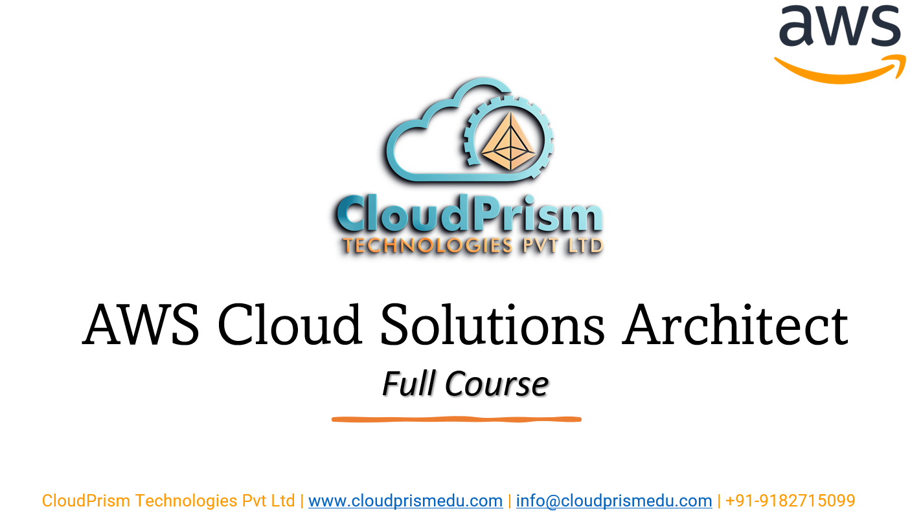
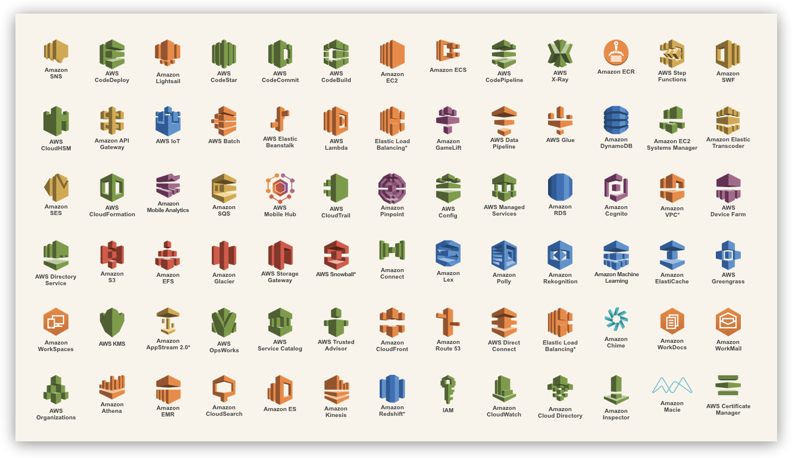

# **AWS Cloud Solutions Architect**

**AWS Solutions Architect** training course from CloudPrism Technologies, one of the top-nutch Cloud Computing & DevOps training organization in Hyderabad, INDIA help you acquire complete knowledge and skills on AWS Cloud with real-world projects and case studies. Our **AWS Cloud Solutions Architect** course enables essential concepts, including Compute, Storage, Networking and Security, Advanced Architecting, Cloud Practitioning and System Operations. 

After completing the **AWS Cloud Solutions Architect** training from CloudPrism Technologies, every aspirant acquires a dream job in IT as a Cloud Solutions engineer. The trainers of CloudPrism Technologies help, aspirants to understand the Amazon Web Services Concepts in an easy way and crack different job opportunities in the cloud computing world. 

Our **AWS Cloud Solutions Architect** Course cirrculam includes every advanced and industry trend AWS Concepts. Therefore, aspirants learn the best practices, upcoming trends, and core concepts in the AWS architecture and easily crack any interviews. 

## **Key Highlights of Course:**

-   Practical assignments for all services
-   Learn from top IT experts having 18+ years of experience
-   Complete Lab Support
-   Providing step-by-step Lab documents with screen shots
-   Cheat sheets to prepare for interviews

## **Who Can enroll for a AWS Certified Solutions Architect Course:**

-   Solutions Architects or Programmers looking to build AWS Skills
-   System Administrators (or) Network Administrators
-   Freshers who is intrested to learning AWS Cloud Computing.
-   Professionals looking to upgrade their skills in the cloud computing domain can take up this AWS Solutions Architect course.

## **Benefits:**

-   Interview Preparation   
    -   Resume Preparation
    -   Mock Interviews
    -   Clarify Interview Questions
-   Lab Documents for each Azure service
-   Mock Tests to prepare in a best way
-   In-Depth AWS syllabus
-   Architecture Based training
-   Real-World Architectures to Practical Lab Included
-   Azure Solutions Architect Expert Training adhered with International Standards
-   Highly qualified & expert Certified Trainers with vast experience
-   Enrich with Industry best practices and case studies and present trends

## **What will students learn in your course?**

-   Knowledge and skills in compute, networking, storage, and database AWS services as well as AWS deployment and management services.
-   Knowledge and skills in deploying, managing, and operating workloads on AWS as well as implementing security controls and compliance requirements.
-   Knowledge and skills in using the AWS Management Console and the AWS Command Line Interface (CLI)Understanding of the AWS Well-Architected Framework, AWS networking, security services, and the AWS global infrastructure.
-   Ability to identify which AWS services meet a given technical requirement and to define technical requirements for an AWS-based application.

**Enroll today to reserve your desk in Cloud Computing World.**

## **Syllabus:**

    
Module 1: Linux Fundamentals

-   Overview of basics commands
-   vim editor modes
-   Filesystem Hierarchy - Basic Concepts
-   File and Directories Creation
-   Filter commands (head, tail, more, less)
-   Creating, Modifyin and Deleting users and groups
-   important files related
-   Linux Permissions
-   Software Management
-   Yum Commands
-   Services and Daemons
-   Different Runlevels

    
Module 2: Introduction to Cloud Computing & AWS

-   What is Cloud Computing?
-   Features and Benefits of Cloud Computing
-   Types Of Cloud Computing Deployment Models
-   Types of Cloud Computing Services
-   Features Of AWS
-   Describe about Various Services in AWS
-   Global Infrastructure
-   Create a free tier account in AWS and onboarding
-   Introduction AWS Management Console

    
Module 3: Networking & Content Delivery

-   Networking Concepts
-   AWS Networking Services
-   Undersatnding AWS Implementation
-   Amazon VPC
-   AWS Transit Gateway
-   AWS Direct Connect
-   AWS Site-to-Site VPN
-   AWS Client VPN
-   AWS Cloud Map
-   Amazon CloudFront
-   Amazon Route 53

    
Module 4: Security, Identity and Compliance

    
-   AWS Identity and Access Management (IAM)
-   AWS Directory Service
-   AWS Firewall Manager
-   AWS Network Firewall
-   AWS Security Hub
-   AWS WAF
-   AWS Shield

    
Module 5: Compute

    
-   Amazon EC2
-   Amazon EC2 Image Builder
-   Auto Scaling Groups
-   ELB

    
Module 6: Storage

    
-   Amazon S3
-   AWS Backup
-   Amazon EBS
-   Amazon EFS

    
Module 7: Database Services

    
-   Amazon RDS
-   Amazon DynamoDB
-   Amazon ElasticCache

    
Module 8: Management & Governance

    
-   Amazon CloudWatch
-   AWS CloudTrail
-   AWS Control Tower
-   AWS Organizations
-   AWS Systems Manager
-   AWS Trusted Advisor

    
Module 9: Other Services

-   Amazon SNS
-   Amazon SQS 

## **AWS Certifications Path:**

