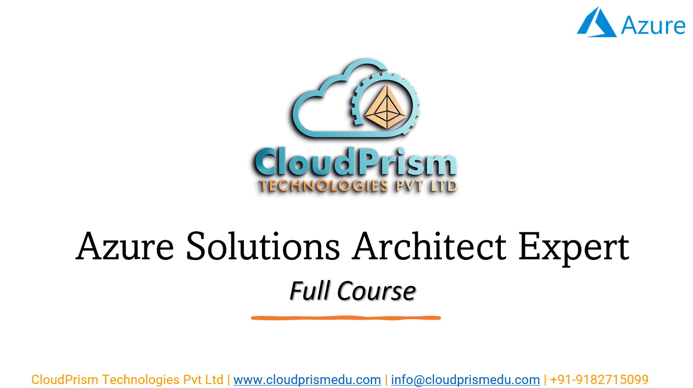
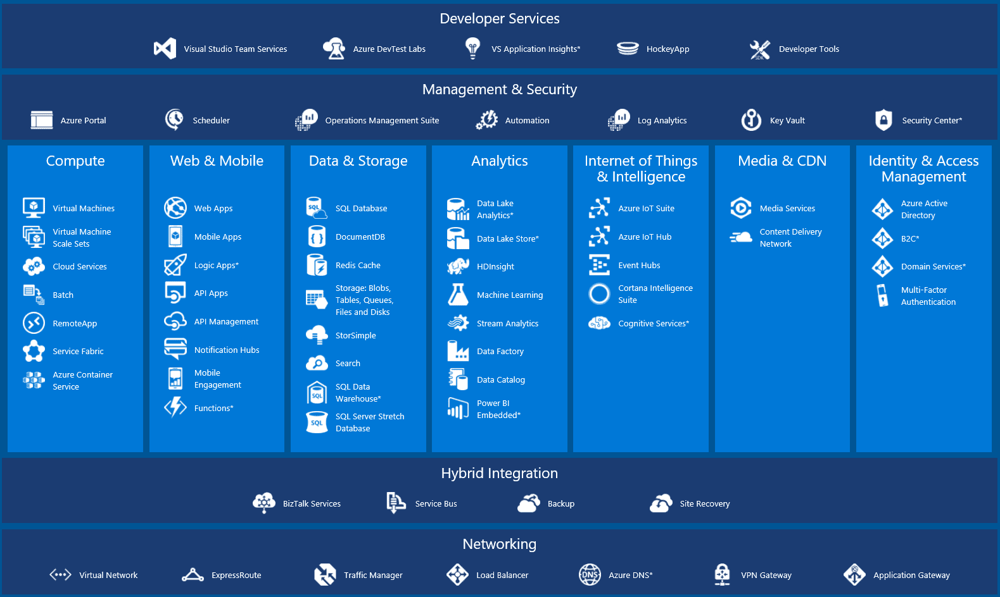
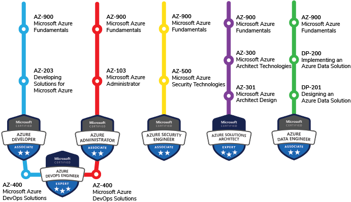
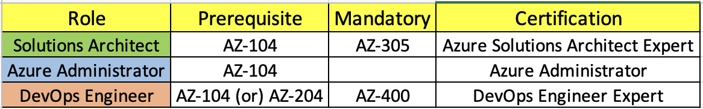

#   **Microsoft Azure Solutions Architect Expert:**

**Azure Solutions Architect** training course from CloudPrism Technologies, one of the top-nutch Cloud Training program offering by CloudPrism Technologies. The **Azure Solutions Architect** training, will  help you acquire complete knowledge and skills on Microsoft Azure Cloud with real-world projects and case studies. Our **Azure Solutions Architect** course enables essential concepts, including Compute, Storage, Networking and Security, Advanced Architecting, Cloud Practitioning and System Operations. 

After completing the **Azure Solutions Architect** training from CloudPrism Technologies, every aspirant acquires a dream job in IT as a Cloud Solutions engineer. The trainers of CloudPrism Technologies help, aspirants to understand the Microsoft Azure Services Concepts in an easy way and crack different job opportunities in the cloud computing world. 

Our **Azure Solutions Architect** Course cirrculam includes every advanced and industry trend AWS Concepts. Therefore, aspirants learn the best practices, upcoming trends, and core concepts in the AWS architecture and easily crack any interviews. 

## **Key Highlights of Course:**

-   Practical assignments for all services
-   Learn from top IT experts having 18+ years of experience
-   Complete Lab Support
-   Providing step-by-step Lab documents with screen shots
-   Cheat sheets to prepare for interviews

## **Who Can enroll for a Microsoft Azure Solutions Architect Expert Course:**

-   Developers/IT Administrators who already have knowledge of Azure Cloud 
-   IT Professionals who are planning to become Azure Solution Architects 
-   Professionals looking to gain a thorough understanding of Designing a Microsoft Azure Infrastructure in an organization
-   Freshers who are looking to start their carrier in Cloud Computing

## **Benefits:**

-   Interview Preparation   
    -   Resume Preparation
    -   Mock Interviews
    -   Clarify Interview Questions
-   Lab Documents for each Azure service
-   Mock Tests to prepare in a best way
-   In-Depth Microsoft Azure syllabus
-   Architecture Based training
-   Real-World Architectures to Practical Lab Included
-   Azure Solutions Architect Expert Training based on real-time use cases and Architectures.
-   Highly qualified & expert Certified Trainers with vast experience
-   Enrich with Industry best practices and case studies and present trends

## **What will students learn in **Azure Solutions architect Expert** course?**

-   Knowledge and skills in compute, networking, storage, and database Azure services as well as Azure deployment and management services.
-   Deploying, managing, and operating workloads on Azure as well as implementing security controls and compliance requirements.
-   Knowledge and skills in using the Azure Console and the Azure Command Line Interface (CLI) Understanding of the Azure Well-Architected Framework, Azure networking, security services, and the AWS global infrastructure.
-   Ability to identify which Azure services meet a given technical requirement and to define technical requirements for an Azure-based application.

## **Career Benefits:**

-   Become Eligible for Professional in Cloud Computing Jobs demanding background
-   Fill the void of thousands of untapped High-Paying Jobs in Cloud Computing Industry
-   Get Promoted in current profile with most in-demand skill
-   Distinguish your profile from peers during Job Interviews
-   Improve CV & LinkedIn Profile with professional development

## **Enroll today to reserve your desk in Cloud Computing World.**

## **Syllabus:**

    
Module 1: Linux Fundamentals

-   Overview of basics commands
-   vim editor modes
-   Filesystem Hierarchy - Basic Concepts
-   File and Directories Creation
-   Filter commands (head, tail, more, less)
-   Creating, Modifyin and Deleting users and groups
-   important files related
-   Linux Permissions
-   Software Management
-   Yum Commands
-   Services and Daemons
-   Different Runlevels

    
Module 2: Microsoft Azure Fundamentls

-   Describe Cloud Computing
-   Features and Benefits of Cloud Computing
-   Types Of Cloud Computing Deployment Models
-   Types of Cloud Computing Services
-   Describe The Core Architectural Components of Azure
-   Describe Azure Compute and networking Services
-   Describe Azure Storage Services
-   Describe Azure Identity, Access and Security
-   Describe Cost Management in Azure
-   Describe Features and Tools in Azure for Goveranance and Compliance
-   Describe Features and Tools Managing and Deploying Azure Resources.
-   Describe Monitoring Tools in Azure
-   Create a free tier account in Azure and onboarding
-   Introduction AWS Management Console

    
Module 3: Prereuisites for Azure administrators

-   Configure Azure resources with tools
-   Use Azure Resource Manager
-   Configure Resources with Azure Resource Manager templates
-   Automate Azure tasks using script with Powershell
-   Consifure Azure Services with the CLI
-   Deploy Azure Infrastructure by using JSON ARM Templates

    
Module 4: Configure and Manager Virtual Networks

-   Configure Virtual Networks
=   Configure Network Security Groups
-   Configure Azure Firewall
-   Configure Azure DNS
-   Cofnigure Virtual Network Peering
-   Configure VPN Gateway
-   Configure ExpressRoute and Virtual WAN
-   Configure Network routing and endpoints
-   Configure Azure Load Balancer
-   Configure Azure Application Gateway
-   Design an IP addressing schema for your Azure Deployment
-   Manage and Control Traffic Flow in your Azure Deployment with routes
-   Improve application scalability and resiliency by using Azure Load Balancer

    
Module 5: Deploy and Manage Azure Compute Resources

-   Configure Virtual Machines
-   Coffigure Virtual Machines Availability
-   Configure Virtual Machine Extensions
-   Configure Azure App Services
-   Manage Virtual Machines with the Azure CLI
-   Host a Web Application with Azure App Service

    
Module 6: Implement and Manage Storage in Azure

-   Create and Configure Storage Accounts
-   Configure Azure Blob Storage
-   Configure Azure Security
-   Configure Azure Files and Azure File Sync
-   Configure Azure Storage with Tools
-   Control Access to Azure Storage with shared access signatures
-   Upload, Download and Manage Data with Azure Storage Explorer

    
Module 7: Manage Identities and governance in Azure

-   Configure Azure Active Directory
-   Configure User and Group Accounts
-   Configure Subscriptions
-   Configure Azure Policy
-   Configure role-based access control
-   Create Azure Users and Groups in Azure Active Directory
-   Secure Azure Resources with Azure role-based access control (Azure RBAC
-   Allow users to reset their password with Azure Active Directory self-service password reset)

    
Module 8: Design Identity, Governance and Monitor Solutions

-   Design Governance
-   Design Authentication and Authorization Solutions
-   Design a Solution to log and Monitor Azure Resources

# Upcoming Batches:

**View Schedule**
**Enroll Now**

# **FAQs**:

### **Why Learn Microsoft Azure?**

Microsoft Azure is one of the fastest growing cloud services. Cloud skills are widely preferred by most of the large enterprises and companies validating more options and availabilities for job opportunities with lucrative salary packages.

### **Can I get a free demo?**

Yes of course, you can contact our team at www.cloudprismedu.com and we will schedule a demo for you.

### **What are the Modes of AWS Training providing?**

Currently, We provide Online training modes for students based on their time zones.

### **How much is the course fee?**

You can contact our team for further details regarding the fees. We will get back to you at the earliest.

### **What are the prerequisites to learn Microsoft Azure?**

There are no specific requirements for enrolling in the AWS course training and our curriculum is designed in a format that can easily be understood by anyone.

## **Azure Certifications Path:**

# Role Based Azure Certification Path:

