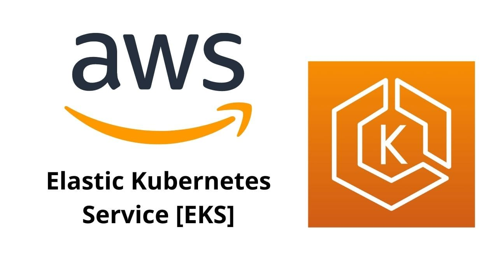
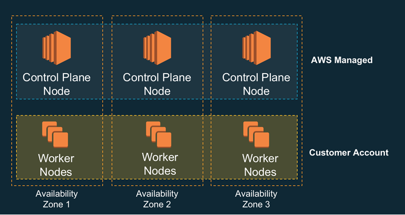

# **AWS EKS Master Class:**

**AWS EKS Master Class** training course from CloudPrism Technologies, one of the top-nutch DevOps Engineer Training program offering by CloudPrism Technologies. The AWS EKS Master Class training, will  help you acquire complete knowledge and skills on Kubernetes with real-world projects and case studies. Our **AWS EKS Master Class** course enables essential concepts, including Cluster Installation, Configuration, Adding Storage, Configuring Networking and Security and Deploy workloads using manifest files and Helm charts, and much more with real-time Scenrios.

After completing the **AWS EKS Master Class** training from CloudPrism Technologies, every aspirant acquires a dream job in IT as a Kubernetes Administrator. The trainers of CloudPrism Technologies help, aspirants to understand the Kubernetes Concepts in an easy way and crack different job opportunities. 

Our **AWS EKS Master Class** Course cirrculam includes every advanced and industry trend Kubernetes Concepts. Therefore, aspirants learn the best practices, upcoming trends, and core concepts in the Kubernetes and easily crack any interviews.

## **Key Highlights of Course:**

-   Practical assignments for all services
-   Learn from top IT experts having 18+ years of experience
-   Complete Lab Support
-   Providing step-by-step Lab documents with screen shots
-   Cheat sheets to prepare for interviews
-   Conducting Mock Tests

## **Who Can enroll for a Kubernetes Administrator Course:**

-   Application Developers
-   Cloud Engineers
-   Site Reliability Engineers (SREs)
-   Software developers

## **Benefits:**

-   Interview Preparation   
    -   Resume Preparation
    -   Mock Interviews
    -   Clarify Interview Questions
-   Lab Documents for each AWS service
-   Mock Tests to prepare in a best way
-   In-Depth AWS EKS & Few AWS Services
-   Architecture Based training
-   Real-World Architectures to Practical Lab Included
-   AWS EKS Master Class Training based on real-time use cases and Architectures.
-   Highly qualified & expert Certified Trainers with vast experience
-   Enrich with Industry best practices and case studies and present trends

## **What will students learn in **Kubernetes Administrator** course?**

-   You will write kubernetes manifests with confidence after going through live template writing sections
-   You will learn using ECR - Elastic Container Registry in combination with EKS.
-   You will learn to enable Autoscaling features like HPA,VPA and Cluster Autoscaler
-   You will learn Docker fundamentals by implementing usecases like download image from Docker Hub and run on local desktop and build an image locally, test and push to Docker Hub.
-   CYou will master many kubectl commands over the process
-   You will learn writing and deploying load balancer k8s manifests for Classic and Network load balancers

## **Carrer Benefits:**

-   Become Eligible for Professional in Cloud Computing and DevOps Jobs demanding background
-   Fill the void of thousands of untapped High-Paying Jobs in Cloud Computing and DevOps Industry
-   Get Promoted in current profile with most in-demand skill
-   Distinguish your profile from peers during Job Interviews
-   Improve CV & LinkedIn Profile with professional development

## *Enroll today to reserve your desk in Cloud Computing World.**

# **Course Content:**

-   Linux Fundamentals
-   Docker Fundamentals
-   Create AWS EKS Cluster using eksctl CLI
-   Introduction
-   Core Concepts
-   Cluster Architecture
-   Containers
-   Workloads
-   Services, Loadbalancing and Networking
-   Load Balancing using CLB & NLB
-   Storage - EKS Storage with AWS EBS CSI driver and EFS
-   Configuration
-   Policies
-   Scheduling, Preemption and Eviction
-   Cluster Administration
-   EKS CA - Cluster Autosaler
-   EKS HPA - Horizontal Pod Autosaler
-   EKS VPA - Vertical Pod Autosaler
-   Upgrade EKS Cluster
-   EKS Monitoring using CloudWatch Agent & Fluentd - Container Insights
-   Troubleshooting
-   Helm

#   **AWS Services Covered:**

|S.No|  AWS Service Name|
|----| ---------------- |
|1.  | AWS EKS - Elastic Kubernetes Service |
|2.  | AWS EBS - Elastic Block Store |
|3.  | AWS RDS - Relational Database Service MySQL |
|4.  | AWS CLB - Classic Load Balancer |
|5.  | AWS NLB - Network Load Balancer |
|6.  | AWS ALB - Application Load Balancer |
|7.  | ALB Ingress Controller   |
|8.  | AWS ECR - Elastic Container Registry |
|9.  | AWS CloudWatch - Container Insights |
|10.  | AWS CloudWatch - Log Groups & Log Insights |
|11. | AWS CloudWatch - Alarms |
|12. | AWS Route53 |
|13. | AWS Certificate Manager |
|14. | EKS CLI - eksctl |

