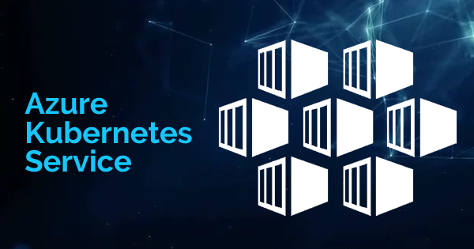

#   **Azure AKS Master Class**:

**Azure AKS Master Class** training course from CloudPrism Technologies, one of the top-nutch DevOps Engineer Training program offering by CloudPrism Technologies. The Azure AKS Master Class training, will  help you acquire complete knowledge and skills on Kubernetes with real-world projects and case studies. Our **Azure AKS Master Class** course enables essential concepts, including Cluster Installation, Configuration, Adding Storage, Configuring Networking and Security and Deploy workloads using manifest files and Helm charts, and much more with real-time Scenrios.

After completing the **Azure AKS Master Class** training from CloudPrism Technologies, every aspirant acquires a dream job in IT as a Kubernetes Administrator. The trainers of CloudPrism Technologies help, aspirants to understand the Kubernetes Concepts in an easy way and crack different job opportunities. 

Our **Azure AKS Master Class** Course cirrculam includes every advanced and industry trend Kubernetes Concepts. Therefore, aspirants learn the best practices, upcoming trends, and core concepts in the Kubernetes and easily crack any interviews.

## **Key Highlights of Course:**

-   Practical assignments for all services
-   Learn from top IT experts having 18+ years of experience
-   Complete Lab Support
-   Providing step-by-step Lab documents with screen shots
-   Cheat sheets to prepare for interviews
-   Conducting Mock Tests

## **Who Can enroll for a Kubernetes Administrator Course:**

-   Application Developers
-   Cloud Engineers
-   Site Reliability Engineers (SREs)
-   Software developers

## **Benefits:**

-   Interview Preparation   
    -   Resume Preparation
    -   Mock Interviews
    -   Clarify Interview Questions
-   Lab Documents for each AWS service
-   Mock Tests to prepare in a best way
-   In-Depth AWS EKS & Few AWS Services
-   Architecture Based training
-   Real-World Architectures to Practical Lab Included
-   Azure AKS Master Class Training based on real-time use cases and Architectures.
-   Highly qualified & expert Certified Trainers with vast experience
-   Enrich with Industry best practices and case studies and present trends

## **What will students learn in **Kubernetes Administrator** course?**

-   You will learn to build Azure AKS Production grade clusters using Azure AKS CLI
-   You will learn to enable Autoscaling features like HPA & Cluster Autoscaler
-   You will learn to integrate Azure AKS with Azure Active Directory for AKS Admins to be created managed in Azure Active Directory
-   You will learn Kubernetes RBAC concepts like role, role-binding, cluster role, cluster role binding in combination with Azure AD for Azure AKS granular level access
-   You will learn writing and deploying load balancer k8s manifests for Azure Standard Load Balancer
-   You will learn Kubernetes Fundamentals in both imperative and declarative approaches

## **Carrer Benefits:**

-   Become Eligible for Professional in Kubernetes Jobs Demanding background
-   Fill the void of thousands of untapped High-Paying Jobs in DevOps Industry
-   Get Promoted in current profile with most in-demand skill
-   Distinguish your profile from peers during Job Interviews
-   Improve CV & LinkedIn Profile with professional development

## *Enroll today to reserve your desk in Cloud Computing World.**

# **Course Modules:**

-   Module 1 - Linux Fundamentals
-   Module 2 - Docker Fundamentals
-   Module 3 - Create Azure AKS Cluster using Azure Portal
-   Module 4 - Kubernetes Fundamentals using kubectl
-   Module 5 - Azure Disks for AKS Storage
-   Module 6 - Custom Storage Class, PVC and PV
-   Module 7 - AKS default Storage class, PVC and PV
-   Module 8 - Kubernetes Secrets
-   Module 9 - Azure Files for AKS Storage
-   Module 10 - Ingress
-   Module 11 - Kubernetes Namespaces
-   Module 12 - Kubernetes Namespaces
-   Module 13 - Azure Container Registry for AKS
-   Module 14 - Azure AKS - Enable HTTP Application Routing AddOn
-   Module 15 - Azure AKS Authentication with Azure AD and Kubernetes RBAC
-   Module 16 - Azure AKS Cluster Autoscaling
-   Module 17 - Azure AKS Cluster Autoscaling

#   **Azure Services Covered:**

|S.No|  Azure Service Name  |
|--- | -------------------- |
|01. | Azure AKS    |
|02. | Azure Disks  |
|03. | Azure Files  |
|04. | Azure Storage Accounts |
|05. | Azure Load Balancer |
|06. | Azure DNS Zones |
|07. | Azure Container Registries ACR |
|08. | Azure Standard Load Balancer |
|09. | Azure Virtual Networks |
|10. | Azure Container Instances - Virtual Nodes |
|11. |Azure Virtual Machine Scale Sets |