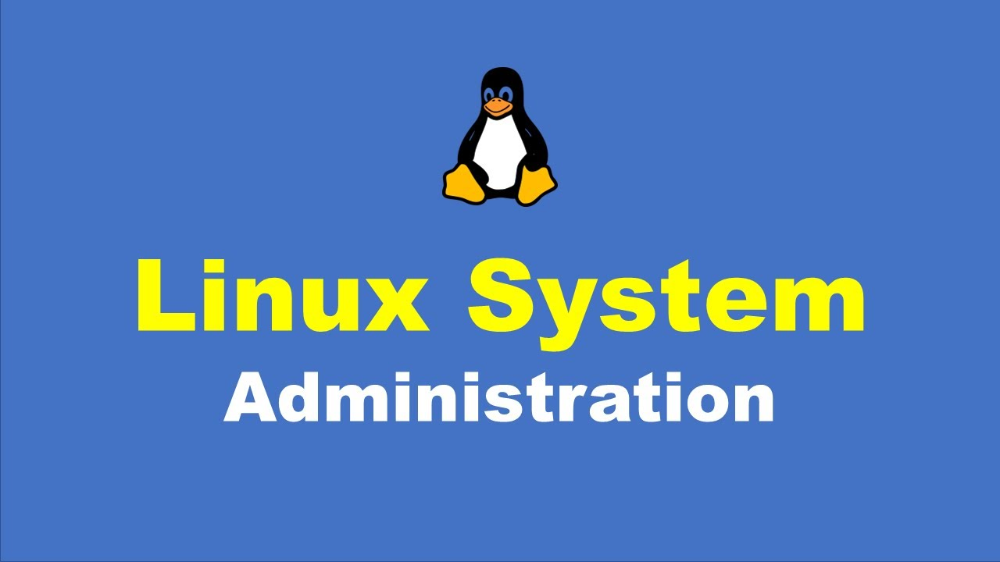

#   **Linux System Administration:**

Linux System Administration is one of the most in-demand skills in IT. Linux is one of the most commonly used operating systems for running corporate and organizational networks.
As such, there is a steady need for administrators in organizations everywhere with working knowledge of maintaining Linux based networks. Linux is a critical skill for IT pros, DevOps engineers, and developers. Linux System Administration course is designed for IT professionals without Previous Linux System Administration knowledge. The course provides students with Linux administration competence by focusing on core administration tasks. This course also provides a foundation for students who plan to become full-time Linux system administrators by introducing key command-line concepts and enterprise-level tools. 

## **Key Highlights of Course:**

-   Practical assignments for all services
-   Learn from top IT experts having 18+ years of experience
-   Complete Lab Support
-   Providing step-by-step Lab documents with screen shots
-   Cheat sheets to prepare for interviews
-   Conducting Mock Tests

## **Who Can enroll for a Kubernetes Administrator Course:**

-   Application Developers
-   Cloud Engineers
-   Site Reliability Engineers (SREs)
-   Software developers

## **Benefits:**

-   Interview Preparation   
    -   Resume Preparation
    -   Mock Interviews
    -   Clarify Interview Questions
-   Lab Documents for each AWS service
-   Mock Tests to prepare in a best way
-   In-Depth AWS EKS & Few AWS Services
-   Architecture Based training
-   Real-World Architectures to Practical Lab Included
-   Azure AKS Master Class Training based on real-time use cases and Architectures.
-   Highly qualified & expert Certified Trainers with vast experience
-   Enrich with Industry best practices and case studies and present trends

## **What will students learn in **Linux System Administrator** course?**

-   In this course you will learn how to administer, configure and upgrade Linux systems running one of the three major Linux distribution families.
-   how to master the tools and concepts you’ll need to efficiently build and manage an enterprise Linux infrastructure.
-   how to work with Git and perform essential collaborative tasks,
-   how to use state-of-the-art system administration techniques in real-life scenarios via practical labs, and more.
-   By the end of this course you will be a professional Linux administrator and be able to apply for Linux jobs
-   You will gain advance Linux systems administration skills and have deep understanding of Linux fundamentals and concepts
-   You will be able to troubleshoot everyday Linux related issues

## *Enroll today to reserve your desk in Linux Administration World.**

#   **Course Content:**

-   Introduction
-   Module 01 - Understanding Linux Concepts
-   Module 02 - Download, Install and Configure Linux OS
-   Module 03 - Linux Fundamentals
-   Module 04 - File System Management
-   Module 05 - User and Group Management
-   Module 06 - Package Management
-   Module 07 - Logical Volume Management (LVM)
-   Module 08 - Security
-   Module 09 - Configure and Managing Networking & Infrastructure Services
-   Module 10 - System Administration and Run Levels
-   Module 11 - Deploying Web Servers and Reverse Proxys
-   Module 12 - Monitoring & Troubleshooting

